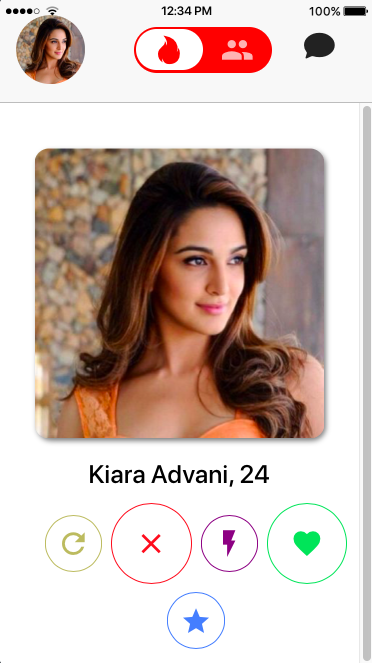
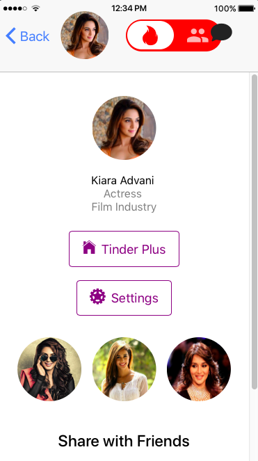
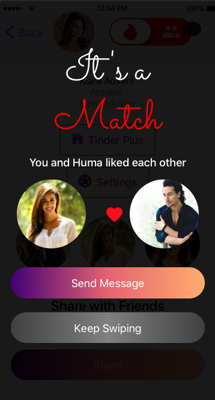
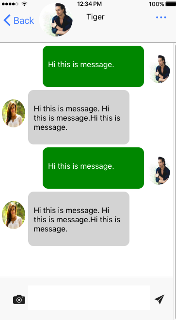
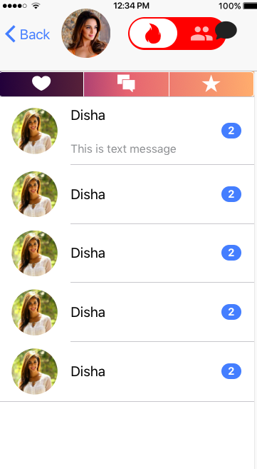
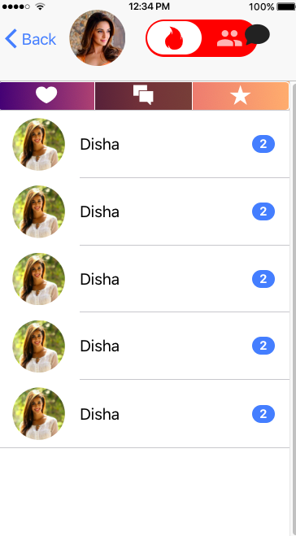

# Tinder-UI
This repo has sample code for the Tinder Like Application for Ionic Developers. You can simply download and implement your logic for your starter app in Ionic.

This repo eases your work for creating a complex app. You can use this as a example project. 

To learn Ionic 2 and 3 visit,

1. https://ampersandacademy.com/tutorials/ionic-framework-version-2

2. https://ampersandacademy.com/tutorials/ionic-framework-3

# how to try this demo app

1. Create a new Ionic 3 project using

`ionic start tinderApp blank`

2. Download and replace the src, www folder.

3. Then preview the app using

`ionic serve -l`

# Screens:

    

    

   

### Note
We will try and update the source code further.
